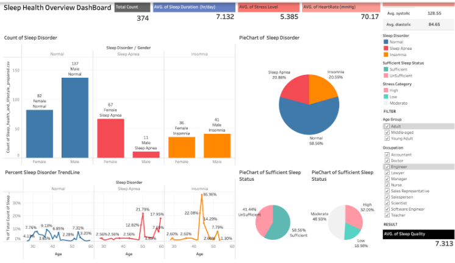

# Heath and Sleep Relation

> CP372-PA-SS

Analyze the relationship between sleep quality and various health and lifestyle factors. The goal is to generate summarized insights within 2 weeks to answer whether certain habits or physical conditions affect sleep quality or vice versa. This will be done using real data and visualized using Python and Tableau.

## Dataset

https://www.kaggle.com/datasets/orvile/health-and-sleep-relation-2024

## List of Contents

-   [Project Canvas](./docs/Canvas.md)
-   [Data Preparation](./src/Sleep_health_and_lifestyle.ipynb)
-   [EDA Analysis](./docs/EDA.md)
-   [In-Depth Analysis](./docs/indepthAnalysis.md)

## Link to Tableau Public Dashboard

[Dashbord](https://public.tableau.com/app/profile/siripassorn.siwanno/viz/Sleep_health_and_lifestyle_DashBoard/FINALDB1SleepHealthOverview?publish=yes)

## YouTube Video

-   [YouTube]()

## Member Crews

| Name                 | Student ID  |
| -------------------- | ----------- |
| Purinutt Amartayavis | 65102010126 |
| Siripassorn Siwanno  | 65102010424 |
