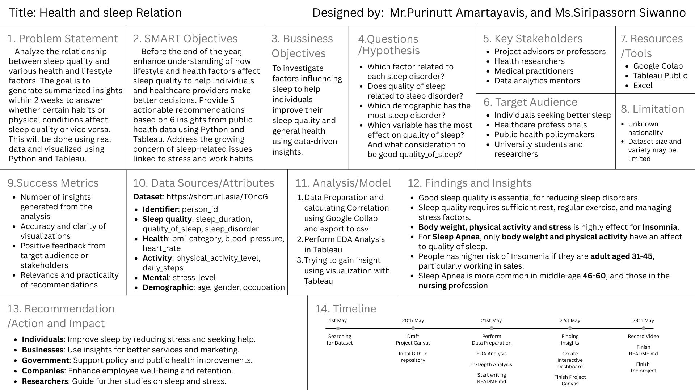
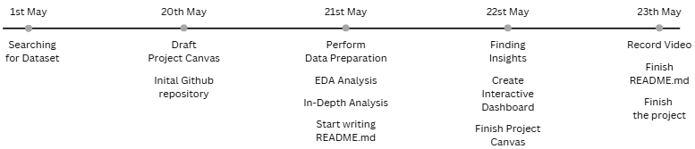

[Back](../README.md)

# Project canvas

## Overview

## Problem Statement

Analyze the relationship between sleep quality and various health and lifestyle factors. The goal is to generate summarized insights within 2 weeks to answer whether certain habits or physical conditions affect sleep quality or vice versa. This will be done using real data and visualized using Python and Tableau.

## SMART Objective

Before the end of the year, enhance understanding of how lifestyle and health factors affect sleep quality to help individuals and healthcare providers make better decisions. Provide 5 actionable recommendations based on 6 insights from public health data using Python and Tableau. Address the growing concern of sleep-related issues linked to stress and work habits.

## Bussiness Objective

To investigate factors influencing sleep to help individuals improve their sleep quality and general health using data-driven insights.

## Questions /Hypothesis

1.  Which factor related to each sleep disorder?
1.  Does quality of sleep related to sleep disorder?
1.  Which demographic has the most sleep disorder?
1.  Which variable has the most effect on quality of sleep? And what consideration to be good quality_of_sleep?

## Key Stakeholders

-   Project advisors or professors
-   Health researchers
-   Medical practitioners
-   Data analytics mentors

## Target Audience

-   Individuals seeking better sleep
-   Healthcare professionals
-   Public health policymakers
-   University students and researchers

## Resources/Tools

-   Google Colab
-   Tableau Public

## Limitation

-   Unknown nationality
-   Dataset size and variety may be limited

## Success Metrics

-   Number of insights generated from the analysis
-   Accuracy and clarity of visualizations
-   Positive feedback from target audience or stakeholders
-   Relevance and practicality of recommendations

## Data Sources/Attributes

Dataset: https://shorturl.asia/T0ncG

-   **Identifier**: person_id
-   **Sleep quality**: sleep_duration, quality_of_sleep, sleep_disorder
-   **Health**: bmi_category, blood_pressure, heart_rate
-   **Activity**: physical_activity_level, daily_steps
-   **Mental**: stress_level
-   **Demographic**: age, gender, occupation

## Analysis/Model

1. Data Preparation and calculating Correlation using Google Collab and export to csv
2. Perform EDA Analysis in Tableau
3. Trying to gain insight using visualization with Tableau

## Findings and Insights

-   Good sleep quality is essential for reducing sleep disorders.
-   Sleep quality requires sufficient rest, regular exercise, and managing stress factors.
-   Body weight, physical activity and stress is highly effect for Insomnia.
-   For Sleep Apnea, only body weight and physical activity have an affect to quality of sleep.
-   People has higher risk of Insomenia if they are adult aged 31-45, particularly working in sales.
-   Sleep Apnea is more common in middle-age 46-60, and those in the nursing profession

## Recommendation/Action and Impact

-   **Individuals**: Improve sleep by reducing stress and seeking help.
-   **Businesses**: Use insights for better services and marketing.
-   **Government**: Support policy and public health improvements.
-   **Companies**: Enhance employee well-being and retention.
-   **Researchers**: Guide further studies on sleep and stress.

## Timeline

