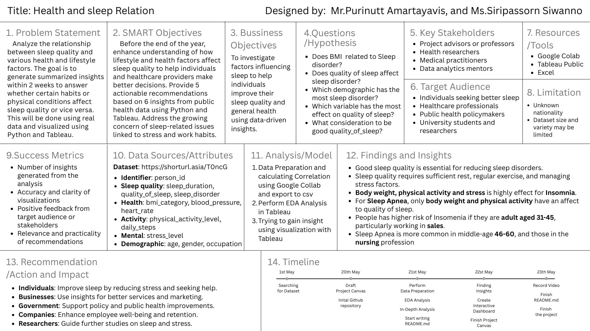

[Back](../README.md)

# Project canvas

## Overview

## Problem Statement

Analyze the relationship between sleep quality and various health and lifestyle factors. The goal is to generate summarized insights within 2 weeks to answer whether certain habits or physical conditions affect sleep quality or vice versa. This will be done using real data and visualized using Python and Tableau.

## SMART Objective

Before the end of the year, enhance understanding of how lifestyle and health factors affect sleep quality to help individuals and healthcare providers make better decisions. Provide 3 actionable recommendations based on 5 insights from public health data using Python and Tableau. Address the growing concern of sleep-related issues linked to stress and work habits.

## Bussiness Objective

To investigate factors influencing sleep to help individuals improve their sleep quality and general health using data-driven insights.

## Questions /Hypothesis

-   Does BMI related to Sleep disorder?
-   Does quality of sleep affect sleep disorder?
-   Which demographic has the most sleep disorder?

## Key Stakeholders

-   Project advisors or professors
-   Health researchers
-   Medical practitioners
-   Data analytics mentors

## Target Audience

-   Individuals seeking better sleep
-   Healthcare professionals
-   Public health policymakers
-   University students and researchers

## Resources/Tools

-   Google Colab
-   Tableau Public

## Limitation

-   Unknown nationality
-   Dataset size and variety may be limited

## Success Metrics

-   Number of insights generated from the analysis
-   Accuracy and clarity of visualizations
-   Positive feedback from target audience or stakeholders
-   Relevance and practicality of recommendations

## Data Sources/Attributes

-   **Identifier**: person_id
-   **Sleep quality**: sleep_duration, quality_of_sleep, sleep_disorder
-   **Health**: bmi_category, blood_pressure, heart_rate
-   **Activity**: physical_activity_level, daily_steps
-   **Mental**: stress_level
-   **Demographic**: age, gender, occupation

## Analysis/Model

1. Data Preparation and calculating Correlation using Google Collab and export to csv
2. Perform EDA Analysis in Tableau

## Findings and Insights

## Recommendation/Action and Impact

## Timeline
