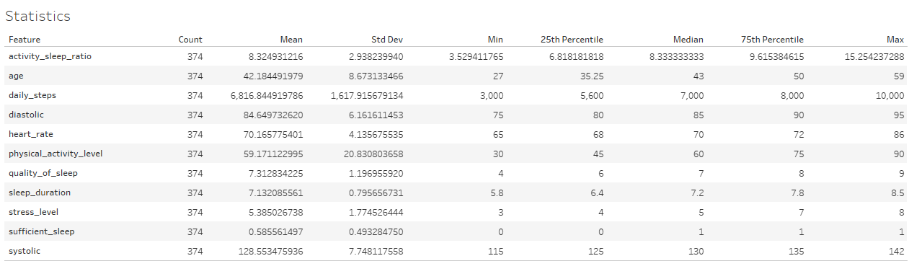
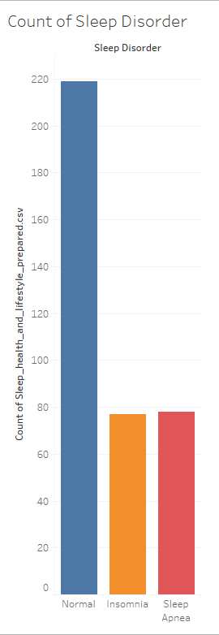
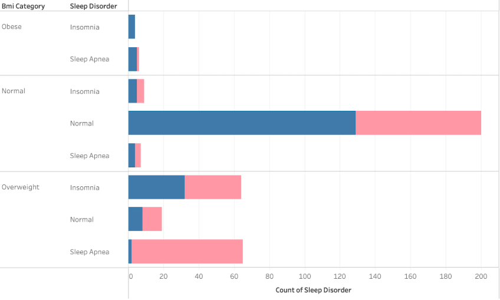
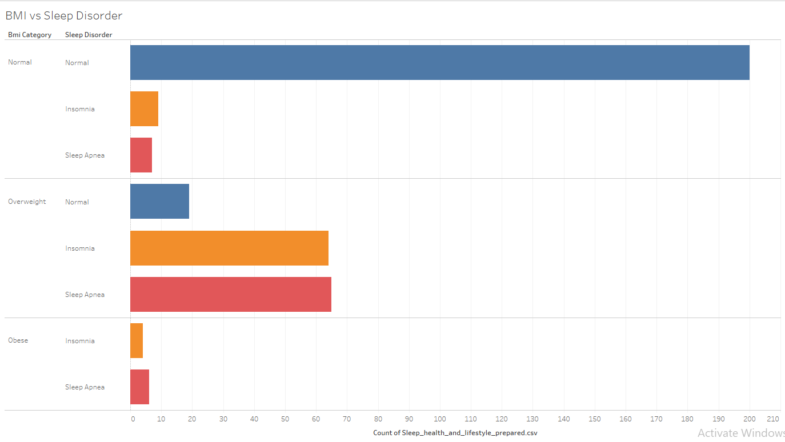
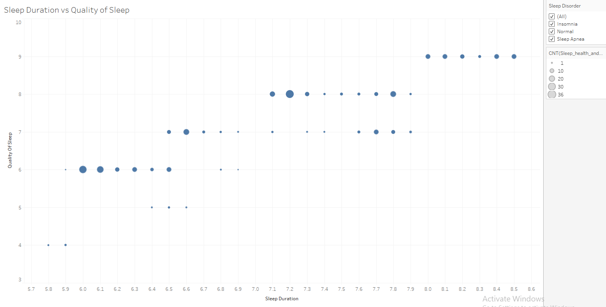
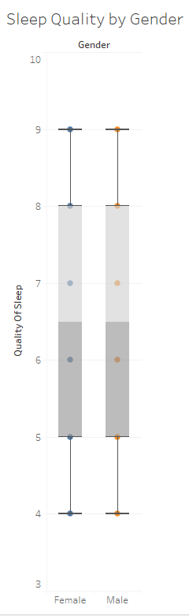
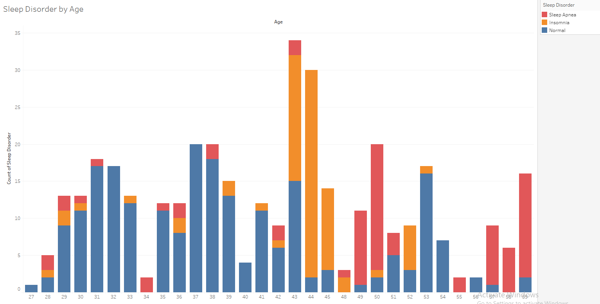
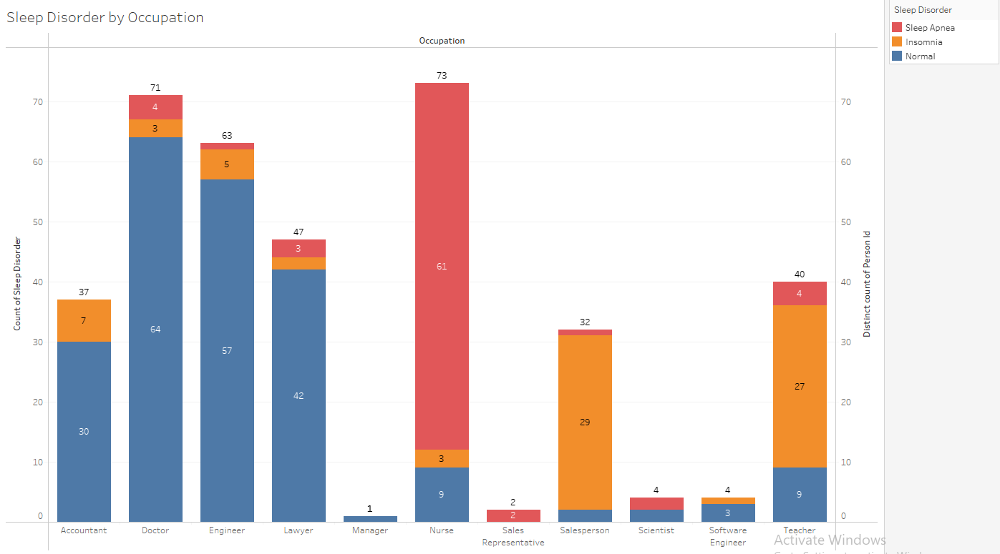

[Back](../README.md)

# EDA Analysis

## Statistics

## Visualization

### Count of Sleep Disorder

### BMI vs Sleep Disorder

### Sleep Duration vs Quality of Sleep

### Sleep Quality by Gender

### Sleep Disorder by Age

### Sleep Disorder by Occupation

