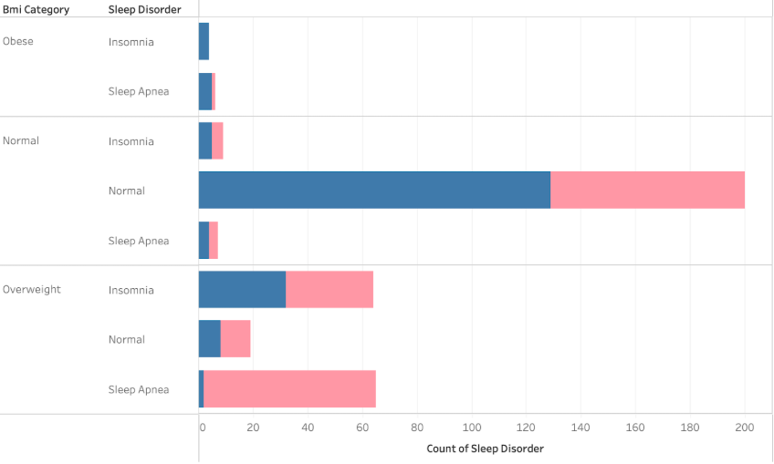
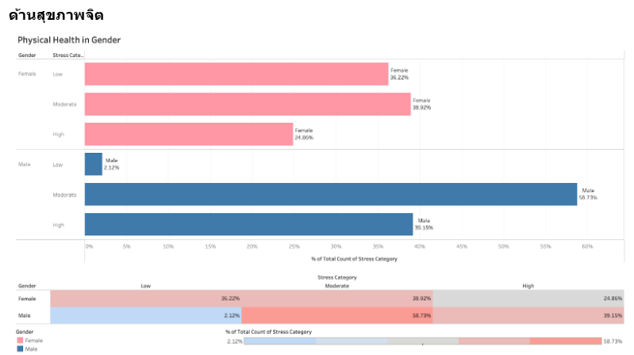

[Back](../README.md)

# In-Depth Analysis

## List of Questions

1. [Which factor related to each sleep disorder?](#which-factor-related-to-each-sleep-disorder)
2. [Does quality of sleep affect sleep disorder?](#does-quality-of-sleep-related-to-sleep-disorder)
3. [Which demographic has the most sleep disorder?](#which-demographic-has-the-most-sleep-disorder)
4. [Which variable has the most effect on quality of sleep? And what consideration to be good quality of sleep?](#which-variable-has-the-most-effect-on-quality-of-sleep-and-what-consideration-to-be-good-quality_of_sleep)

## Which factor related to each sleep disorder?

### Physical Body Health Factors

The bar chart shows both the people with Sleep Apnea or Insonia mostly categorized in Overweight while the people with no sleep disorder mostly in Normal BMI

But...

Since the bmi_category data of Obese has a relatively small proportion of data, which is different from the other proportions, it cannot be concluded together

### Physical Activity Factors

From the boxplot, the people with sleep disorder have a lower distribution of data in terms of exercise activities and number of steps per day than normal people.

### Mental Health Factors

From the bloxplot, people with sleep disorder have a fairly wide distribution of stress levels.

But, people with Insomnia is experince moderate to high level of stress.

### Summary

| Factors                        | Normal          | Insomnia   | Sleep Apnea |
| ------------------------------ | --------------- | ---------- | ----------- |
| Physical Heath (BMI)           | Normal          | Overweight | Overweight  |
| Physical Activity (Exercise)   | Active          | Sedentary  | Sedentary   |
| Mental Health Factors (Stress) | Low to Moderate | High       | Moderate    |

-   Insomnia and Sleep Apnea share similar characteristics: being overweight, lack of exercise
-   Most people with Insomnia are highly stressed

## Does quality of sleep related to sleep disorder?

From the graph, the average value of each quality_of_sleep is not much different. However, looking at the distribution of data in the box plot on the right, it can be seen that normal people who do not have a disease have values ​​distributed in the range of 6-9, which means **that having good sleep health must also have good sleep quality values**.

## Which demographic has the most sleep disorder?

### Population characteristics - Age range

From the graph, it was found that the percentage of sleep problems increased with increasing age. From the data that is only available for people aged 27-59

When going into details, it was found that

-   **Insomnia**
    occurs in the Adult age group (31-45 years) with the highest percentage, which is 27.16%
    Next is Young Adult age group (19-30 years) with the highest percentage, which is 12.50%
-   **Sleep Apnea**
    occurs in the Middle-Aged age group (46-60 years) with the highest percentage, which is 55.45%
    Next is Young Adult age group (19-30 years) with the highest percentage, which is 15.63%

Although there is a tendency to have a higher chance of developing the disease as we age, this graph shows that overall, there is a tendency to have better sleep quality and slightly more sleep duration as we age.

### Population characteristics - Occupation

From the graph, it was found that the occupations of Nurse, Teacher, and Salesperson had the most sleep-related diseases, respectively. Nurses mostly had Sleep Apnea, and Teachers and Salespersons mostly had Sleep Apnea.

So we focus to analyze the occupations of Nurse, Teacher, Salesperson

#### Quality Of Sleep

From the Distribution of Sleep Quality graph, it was found that the sleep quality of people with sleep disorders in all three occupations and both diseases had data distributed within the range that was not very good compared to normal people.

And when comparing the percentage of people in that occupation who got enough sleep, that is, people who slept more than or equal to 7 hours per day, it was found that **insufficient sleep affected Insomia. However, it could not be concluded that insufficient sleep affected Sleep Apnea** or was an indicator that there would be no problems with sleeping. It may be because the measurement period was not long enough. Insufficient sleep, if done in a period that was not consecutive for a long enough time, may not cause any negative effects or cause sleep disorders.

#### Physical Health

From the graph, because the data is too little and not complete in every category, the BMI criteria for Normal and Obese are not met. **It can be seen that people with the disease in all three occupations have BMI values ​​that are in the Overweight range**.

#### Physical Activity

From the data, it can be concluded that in the three occupations with a high chance of getting the disease, there are

-   Exercise in the range of 44-59 minutes per day, which is in the Light category, has a high chance of getting Insomia
-   Exercise is not related to Sleep Apnea.

#### Mental Health

From the data, it can be concluded that in the three occupations with high chances of getting the disease, there is

-   Stress which causes Insomnia
-   Stress is not related to Sleep Apnea.

#### Summary

| Factor                        | Nurse      | Salesperson | Teacher    |
| ----------------------------- | ---------- | ----------- | ---------- |
| Physical Health (BMI)         | Overweight | Overweight  | Overweight |
| Physicsal Activity (Exercise) | Active     | Light       | Light      |
| Mental Health (Stress)        | High       | High        | Moderate   |

### Population characteristics - Gender

#### Quality Of Sleep

From the graph, it can be seen that

-   Proportion of Gender
    -   The number of data of male and female is equal in this data set.
-   Sufficient Sleep in Gender
    -   Men get more sleep than women.
    -   Most people with diseases do not get enough sleep.
-   Quality of Sleep in Gender
    -   The average quality of sleep is similar, but women have a slightly higher number.

#### Physical Health

From the graph, it is found that
BMI criteria

-   Normal is more common in males than
-   Obese is more common in males but less in this dataset
-   Overweight is more common in females

Gender

-   Male is found Normal > Overweight > Obese
-   Female is found Overweight > Normal > Obese

In conclusion, it is found that men have a BMI value in the normal range more than women.

#### Physical Activity

om the graph, it can be seen that
Men and women have a wide range of activity levels, as well as the number of steps walked per day. **Men and women do not differ in this respect**.

#### Mental Health

From the graph, it can be seen that

-   Women have a stress range in the Low (Low) - Moderate (Moderate) category.
-   Men have a stress range in the Moderate (Moderate) - High (High) category.

In conclusion, men have a higher level of stress than women for the most part.

#### Summary

From all the data, it can be concluded that women have a slightly better quality of sleep than men.

| Factor                        | Female                | Male                   |
| ----------------------------- | --------------------- | ---------------------- |
| Quality Of Sleep              | Less sleep sufficient |                        |
| Physical Health (BMI)         | has higher BMI        | Overweight             |
| Physicsal Activity (Exercise) | No Different          | No Different           |
| Mental Health (Stress)        |                       | More exposed to Stress |

However, the results were quite contradictory to the correlation values, so gender was not a factor that could discriminate sleep quality.

## Which variable has the most effect on quality of sleep? And what consideration to be good quality of sleep?

### Correlation

From the correlation values ​​of quality_of_sleep, it was found that the relationship values ​​between the variables can be grouped as follows:

| Relationship pattern                                           | Range       | Variable                                   | Interpret                                                                                          |
| -------------------------------------------------------------- | ----------- | ------------------------------------------ | -------------------------------------------------------------------------------------------------- |
| The two variables are highly and inversely related.            | [-1.0,-0.5) | ◦ heart_rate   ◦ stress_level          | When sleep quality is good, heart_rate,stress_level values ​​are significantly lower.              |
| The two variables are slightly and inversely related.          | [-5.0,-0.1] | ◦ diastolic   ◦ systolic               | When sleep quality is good, diastolic,systolic values ​​will be slightly lower.                    |
| The two variables are not related to each other.               | (-0.1,0.1)  | ◦ activity_sleep_ratio   ◦ daily_steps | Cannot tell the relationship                                                                       |
| The two variables are slightly related in the same direction.  | [0.1-0.5]   | ◦ physical_activity_level   ◦ age      | When sleep quality is good, physical_activity_level, age values ​​are slightly higher.             |
| The two variables are highly correlated in the same direction. | (0.5,1]     | ◦ sleep_duration   ◦ sufficient_sleep  | When sleep quality is good, sleep_duration and sufficient_sleep values ​​are significantly higher. |

In conclusion, which variable has the most impact on quality_of_sleep?

1. Stress_Level
1. Sleep Duration (Sufficient Sleep)
1. Heart rate
